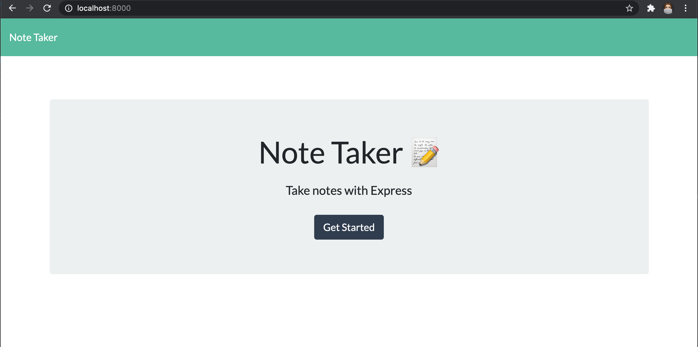
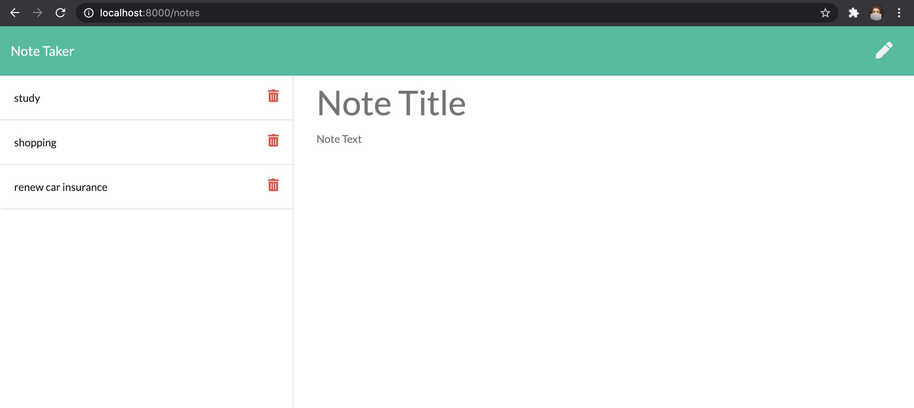

 

# Handy Note Taker

## Description
A Node application that can be used to write, save, and delete notes. This application uses an express backend and save and retrieve note data from a JSON file. 

For this project i was provided client-side html, css and javascript files, and was tasked with creating a node server and routes, using express framework, and handling the post and get requests using the fs module. I also implemented async await fuctions and promises for all helper functions that connected the db and routes to the front-end. 

### User Story

> As a **user**, I want to **be able to write and save notes** and I WANT **to be able to delete notes I've written before** so that **I can organize my thoughts and keep track of tasks I need to complete**.

## Table of Contents
- [Preview](#Preview)
- [Execute](#Execute)
- [Usage](#Usage)
- [Contributing](#Contributing)
- [Test](#Test)
- [License](#License)
- [Environment](#Environment)
- [Questions](#Questions)

## Preview

> Watch a full demo video on my [YouTube channel]()

The application is hosted on Heroku and can be accessed here:(https://youtu.be/nbFUqCOI3fQ).

## Execute
Clone the repo and in the command line run `npm install` to download all the npm package dependancies which include Express, Nodemon and Nanoid.

Then invoke the application with command `node server.js` or by using the nodemon script `npm run dev`.

## Usage
On the client browser, the application will display any stored notes and make these availabe to view and delete. The user can also add new notes which send a post request to the server.

## Contributing
Contributions are welcomed.

## Test
Feel free to explore and feedback with any suggestions or improvements.

## License
MIT

## Environment
* [Visual Studio Code](https://code.visualstudio.com/)
* Mac Terminal
* [Git](https://git-scm.com/book/en/v2/Getting-Started-Installing-Git)
* [Node.js](https://nodejs.org/en/)
* [NPM](https://www.npmjs.com/)
* [Express](https://www.npmjs.com/package/express)
* [nanoid npm package](https://www.npmjs.com/package/nanoid)
* [nodemon npm package](https://www.npmjs.com/package/nodemon)

## Questions
Follow me on [GitHub: rubybassi](https://github.com/rubybassi)

If you have any additional questions, simply email me at <thecodingfiles@gmail.com> and i'll respond as soon as possible.